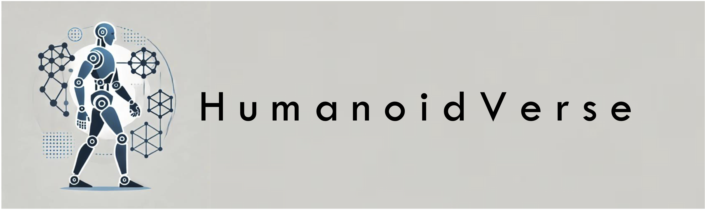
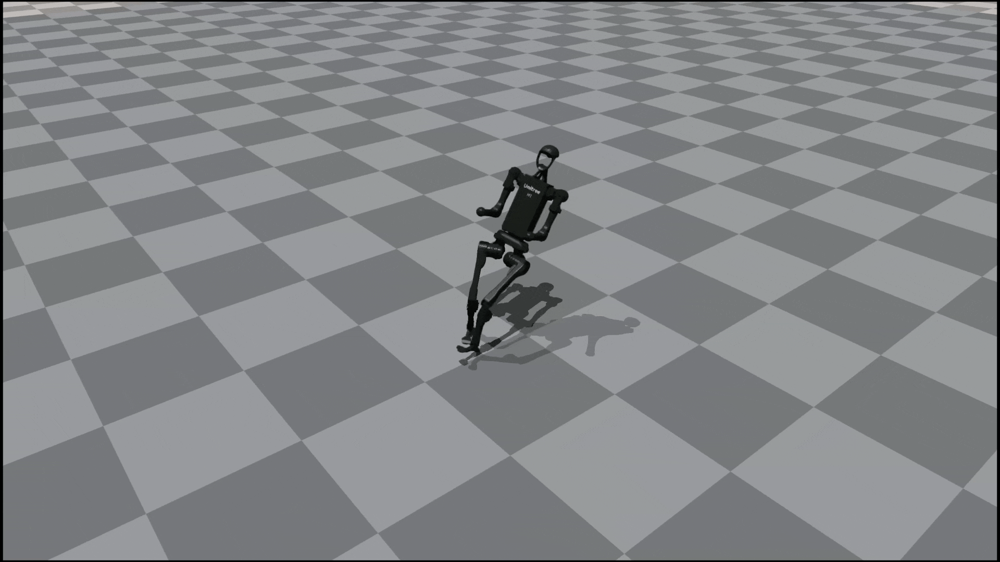
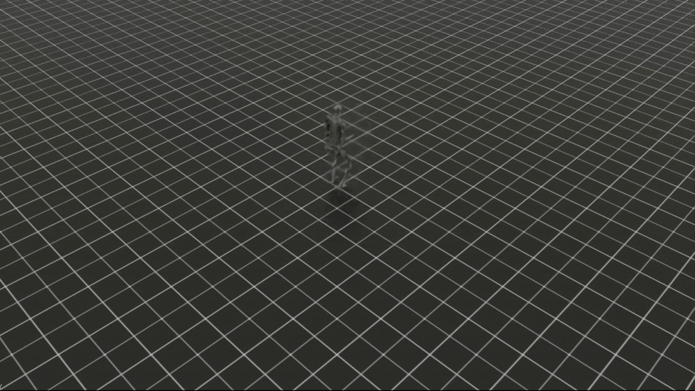
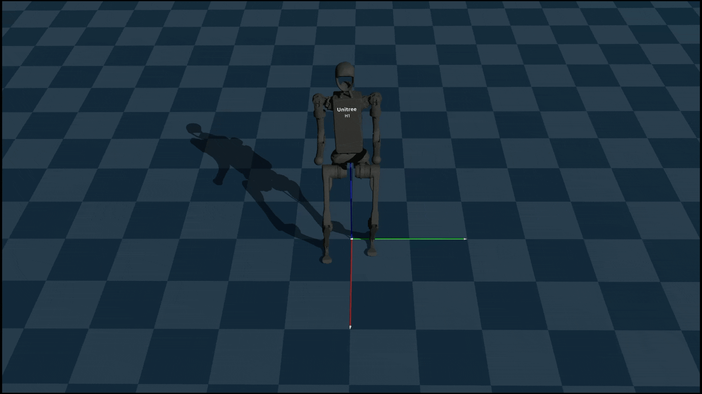
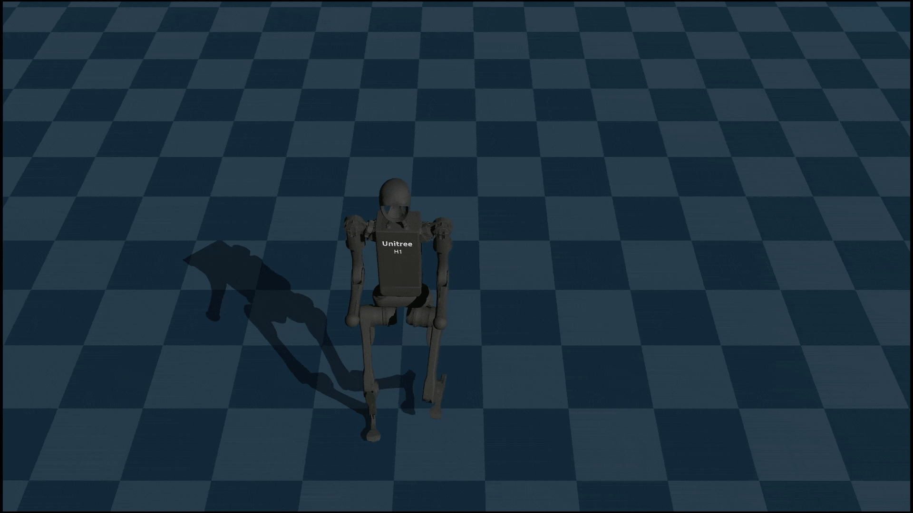
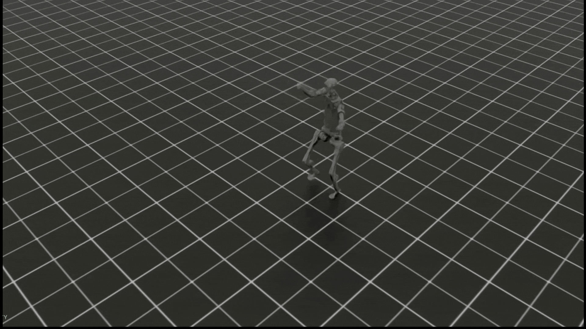
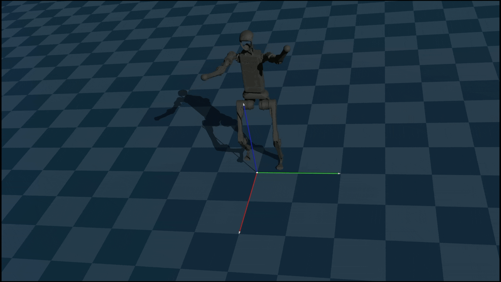
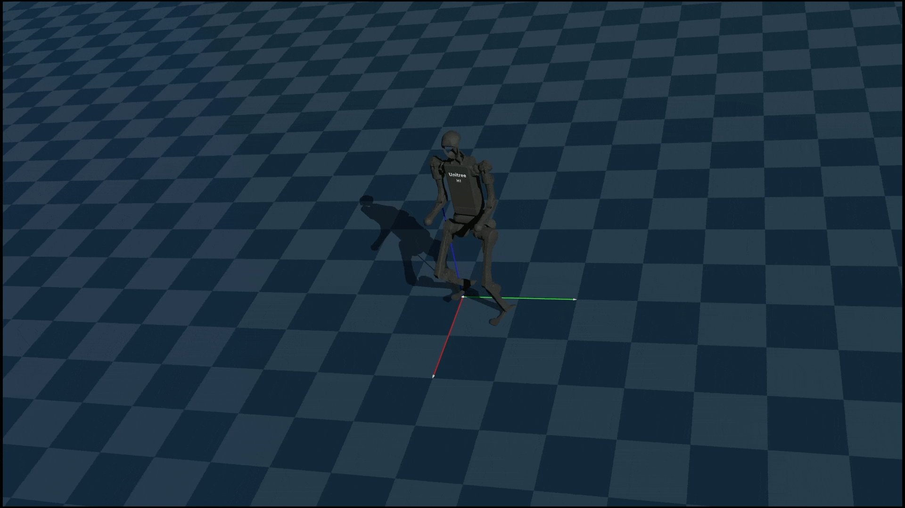
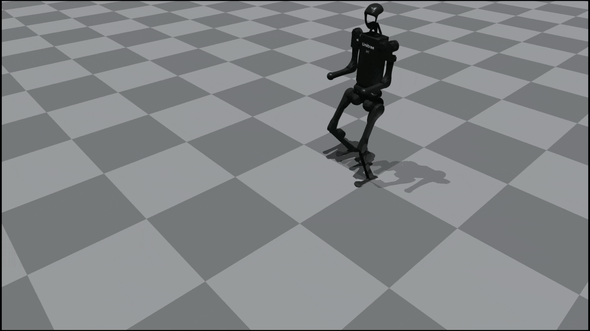

<h1 align="center"> HumanoidVerse: A Multi-Simulator Framework for 
    
Humanoid Robot Sim-to-Real Learning. </h1>

<div align="center">
<p align="center">
     &nbsp; &nbsp; &nbsp; &nbsp; &nbsp; &nbsp; &nbsp; &nbsp; &nbsp; &nbsp;
</p>


[](https://developer.nvidia.com/isaac-gym)

[](https://docs.isaacsim.omniverse.nvidia.com/4.2.0/index.html)

[](https://docs.isaacsim.omniverse.nvidia.com/4.2.0/index.html)


[](https://ubuntu.com/blog/tag/22-04-lts)
[]()

</div>

# What is HumanoidVerse?
HumanoidVerse supports multiple simulators and tasks for humanoid robot sim-to-real learning. A key design logic is the separation and modularization of simulators, tasks, and algorithms, allowing for conviniently switching between simulators and tasks, and develop new ones with minimal efforts.

We compared the scope of HumanoidVerse with other sim-to-real frameworks and summarized the differences in supported features in the following table:

<div align="center">

| Framework | Multi Simulators | Sim2Sim & Sim2Real |
| --- | --- | --- |
| HumanoidVerse | :white_check_mark: | :white_check_mark: |
| [Mujoco Playground](https://playground.mujoco.org/#) | :x: | :white_check_mark: |
| [ProtoMotions](https://github.com/NVlabs/ProtoMotions) | :white_check_mark: | :x: |
| [Humanoid Gym](https://github.com/roboterax/humanoid-gym) | :x: | :white_check_mark: |
| [Unitree RL Gym](https://github.com/unitreerobotics/unitree_rl_gym) | :x: | :white_check_mark: |
| [Legged Gym](https://github.com/leggedrobotics/legged_gym) | :x: | :x: |

</div>

## TODO
- [x] Support for multiple simulators: (Currently) IsaacGym, Genesis, IsaacLab.
- [x] Support for multiple embodiments: (Currently) Unitree Humanoid H1-10DoF, H1-19DoF, G1-12DoF, G1-23DoF.
- [ ] Sim-to-Sim and Sim-to-Real pipelines.
- [ ] Motion tracking tasks.

# News

- 2025-02-04: :tada: Initial Public Release! We have released the locomotion training pipeline for humanoid robots in IsaacGym, IsaacSim and Genesis.


# Installation

Note: 
- We recommend using `mamba` other than using `conda`, beacuse `mamba` is faster. Refer to [Docs of Mamaba](https://mamba.readthedocs.io/en/latest/installation/mamba-installation.html) to install mamba.
- We are creating separate environments for each simulator, to avoid the dependency hell of different simulators.
- You do not need to install all of the simulators at once. If you only want to use IsaacGym, you can skip the installation of the other simulators.

## IsaacGym

<details>
<summary>Environment Setup for IsaacGym Simulator.</summary>

Clone the repository from source:

```bash
git clone git@github.com:LeCAR-Lab/HumanoidVerse.git
cd HumanoidVerse
```

Create a virtual environment with python 3.8.

```bash
mamba create -n hgym python=3.8
mamba activate hgym
```

Download [IsaacGym](https://developer.nvidia.com/isaac-gym) outside of the HumanoidVerse repository, and extract it.

```bash
cd ../
wget https://developer.nvidia.com/isaac-gym-preview-4
tar -xvzf isaac-gym-preview-4
```

Now the file structure should look like this:

```text
❯ tree . -L 1
.
├── isaacgym
└── HumanoidVerse

2 directories, 0 files
```

Install IsaacGym Python API, `PyTorch` will be installed at this step.

```bash
pip install -e ./isaacgym/python/.
```

(Optional) Test IsaacGym installation:

```bash
cd isaacgym/python/examples/
python 1080_balls_of_solitude.py # or
python joint_monkey.py
```

Install HumanoidVerse:

```bash
# at the root of HumanoidVerse repository
pip install -e .
```

To test your installation, try a minimum working example of training locomotion task in IsaacGym:

```bash
python humanoidverse/train_agent.py \
+simulator=isaacgym \
+exp=locomotion \
+domain_rand=NO_domain_rand \
+rewards=loco/reward_h1_locomotion \
+robot=h1/h1_10dof \
+terrain=terrain_locomotion_plane \
+obs=loco/leggedloco_obs_singlestep_withlinvel \
num_envs=1 \
project_name=TESTInstallation \
experiment_name=H110dof_loco_IsaacGym \
headless=False
```

Then you should see:


</details>

## IsaacSim

<details>
<summary>Environment Setup for IsaacSim Simulator.</summary>

Clone the repository from source:

```bash
git clone git@github.com:LeCAR-Lab/HumanoidVerse.git
cd HumanoidVerse
```

Create a virtual environment with python 3.10.

```bash
mamba create -n hsim python=3.10
mamba activate 
```
Install IsaacSim following instructions [here](https://isaac-sim.github.io/IsaacLab/main/source/setup/installation/binaries_installation.html#installing-isaac-sim)

Install IsaacLab following instructions [here](https://isaac-sim.github.io/IsaacLab/main/source/setup/installation/binaries_installation.html#installing-isaac-lab)

Install HumanoidVerse:

```bash
pip install -e .
```

To test your installation, try a minimum working example of training locomotion task in IsaacSim:

```bash
python humanoidverse/train_agent.py \
+simulator=isaacsim \
+exp=locomotion \
+domain_rand=NO_domain_rand \
+rewards=loco/reward_h1_locomotion \
+robot=h1/h1_10dof \
+terrain=terrain_locomotion_plane \
+obs=loco/leggedloco_obs_singlestep_withlinvel \
num_envs=1 \
project_name=TESTInstallation \
experiment_name=H110dof_loco_IsaacSim \
headless=False
```

Then you should see:


</details>

## Genesis

<details>
<summary>Environment Setup for Genesis Simulator.</summary>

Clone the repository from source:

```bash
git clone git@github.com:LeCAR-Lab/HumanoidVerse.git
cd HumanoidVerse
```

Create a virtual environment with python 3.10.

```bash
mamba create -n hgen python=3.10
mamba activate hgen
```
Install `Genesis`. Note that `Genesis` simulator is still under development, and some functions such as the built-in `recording` is not stable.

```bash
pip install torch
pip install genesis-world==0.2.1
```

Install HumanoidVerse:

```bash
pip install -e .
```
To test your installation, try a minimum working example of training locomotion task in Genesis:

```bash
python humanoidverse/train_agent.py \
+simulator=genesis \
+exp=locomotion \
+domain_rand=NO_domain_rand \
+rewards=loco/reward_h1_locomotion \
+robot=h1/h1_10dof \
+terrain=terrain_locomotion_plane \
+obs=loco/leggedloco_obs_singlestep_withlinvel \
num_envs=1 \
project_name=TESTInstallation \
experiment_name=H110dof_loco_Genesis \
headless=False
```

Then you should see:


</details>


# Training & Evaluation
We support training & evluating in multiple simulators: `IsaacGym`, `IsaacSim` and `Genesis` by changing only **ONE** command line: `+simulator=<simulator_name>`
## Policy Training
To train your policy, follow this command format:
```bash
python humanoidverse/train_agent.py \
+simulator=<simulator_name> \
+exp=<task_name> \
+domain_rand=<domain_randomization> \
+rewards=<reward_function> \
+robot=<robot_name> \
+terrain=<terrain_name> \
+obs=<observation_name> \
num_envs=<num_envs> \
project_name=<project_name> \
experiment_name=<experiment_name> \
headless=<headless_mode>
```
<details>
<summary>(Optional) By default, the training process is logged by tensorboard. You can also use `wandb` for logging.</summary>

If you want to use `wandb` for logging, you can add `+opt=wandb` in the command.

```bash
python humanoidverse/train_agent.py \
+simulator=isaacgym \
+exp=locomotion \
+domain_rand=NO_domain_rand \
+rewards=loco/reward_h1_locomotion \
+robot=h1/h1_10dof \
+terrain=terrain_locomotion_plane \
+obs=loco/leggedloco_obs_singlestep_withlinvel \
num_envs=4096 \
project_name=HumanoidLocomotion \
experiment_name=H110dof_loco_IsaacGym \
headless=True \
+opt=wandb
```
</details>

## Policy Evaluation

After running the training command, you can find the checkpoints and log files in the `logs/<project_name>/<timestamp>-_<experiment_name>-<exp_type>-<robot_type>` directory.

To evaluate the policy, follow this command format:

```bash
python humanoidverse/eval_agent.py +checkpoint=logs/xxx/../xx.pt
```

`logs/xxx/../xx.pt` is the relative path to the checkpoint file. You only need to run this command, our script will automatically find and load the training config.

<details>
<summary>If you want to override some of the training config, you can use `+` to override the configs.</summary>

```bash
python humanoidverse/eval_agent.py +checkpoint=logs/xxx/../xx.pt \
+domain_rand.push_robots=True \
+simulator=genesis # you can load the policy trained in isaacgym
```
</details>

# Start Training Your Humanoids!

Here are some starting commands to train & evaluate the locomotion policy on Unitree H1 Humanoid Robot among multiple simulators.

## IsaacGym
<details>
<summary>Training Command</summary>

```bash
python humanoidverse/train_agent.py \
+simulator=isaacgym \
+exp=locomotion \
+domain_rand=NO_domain_rand \
+rewards=loco/reward_h1_locomotion \
+robot=h1/h1_10dof \
+terrain=terrain_locomotion_plane \
+obs=loco/leggedloco_obs_singlestep_withlinvel \
num_envs=4096 \
project_name=HumanoidLocomotion \
experiment_name=H110dof_loco_IsaacGym \
headless=True
```
</details>

After around 3000 epochs, evaluating in `IsaacGym` and `Genesis`:
<table>
  <tr>
    <td style="text-align: center;">
      
    </td>
    <td style="text-align: center;">
      
    </td>
  </tr>
</table>


## IsaacSim
<details>
<summary>Training Command</summary>

```bash
python humanoidverse/train_agent.py \
+simulator=isaacsim \
+exp=locomotion \
+domain_rand=NO_domain_rand \
+rewards=loco/reward_h1_locomotion \
+robot=h1/h1 \
+terrain=terrain_locomotion_plane \
+obs=loco/leggedloco_obs_singlestep_withlinvel \
num_envs=4096 \
project_name=HumanoidLocomotion \
experiment_name=H119dof_loco_IsaacSim \
headless=True
```
</details>

After around 3000 epochs, evaluating in `IsaacSim` and `Genesis`:

<table>
  <tr>
    <td style="text-align: center;">
      
    </td>
    <td style="text-align: center;">
      
    </td>
  </tr>
</table>

## Genesis
<details>
<summary>Training Command</summary>

```bash
python humanoidverse/train_agent.py \
+simulator=genesis \
+exp=locomotion \
+domain_rand=NO_domain_rand \
+rewards=loco/reward_h1_locomotion \
+robot=h1/h1_10dof \
+terrain=terrain_locomotion_plane \
+obs=loco/leggedloco_obs_singlestep_withlinvel \
num_envs=4096 \
project_name=HumanoidLocomotion \
experiment_name=H110dof_loco_Genesis \
headless=True \
rewards.reward_penalty_curriculum=True \
rewards.reward_initial_penalty_scale=0.5
```
</details>

After around 5000 epochs, evaluating in `Genesis` and `IsaacGym`:

<table>
  <tr>
    <td style="text-align: center;">
      
    </td>
    <td style="text-align: center;">
      
    </td>
  </tr>
</table>

# References and Acknowledgements

This project is inspired by the following projects:

- [ProtoMotions](https://github.com/NVlabs/ProtoMotions) inspired us to use `hydra` for configuration management and influenced the overall structure of the codebase.
- [Legged Gym](https://github.com/leggedrobotics/legged_gym) provided the reference code for training locomotion tasks, handling domain randomizations, and designing reward functions. The starting point of our codebase is `git clone git@github.com:leggedrobotics/legged_gym.git`.
- [RSL RL](https://github.com/leggedrobotics/rsl_rl) provided an example for the implementation of the PPO algorithm.

This project is made possible thanks to our amazing team members at [LeCAR Lab](https://lecar-lab.github.io/):
- [Gao Jiawei](https://gao-jiawei.com/) led the development of this project, designed the overall architecture, and implemented the core components, including the simulators, robots, tasks, and the training and evaluation framework. 
- [Tairan He](https://tairanhe.com/) implemented the design of domain randomizations, integrated the IsaacSim simulator (together with Zi Wang), and helped significantly with debugging in the early stages of the project.
- [Wenli Xiao](https://wenlixiao-cs.github.io/) implemented the design of the observation dictionary, proprioception configuration, and history handlers, designed the actor-critic network architecture in PPO, and also helped greatly with debugging in the early stages of the project.
- [Yuanhang Zhang](https://hang0610.github.io/) contributed significantly to the sim-to-sim and sim-to-real pipelines and helped with debugging our PPO implementation.
- [Zi Wang](https://www.linkedin.com/in/zi-wang-b675aa236/) integrated the IsaacSim simulator into HumanoidVerse.
- [Ziyan Xiong](https://ziyanx02.github.io/) integrated the Genesis simulator into HumanoidVerse.
- [Haotian Lin](https://www.linkedin.com/in/haotian-lin-9b29b7324/) implemented MPPI in HumanoidVerse (to be released soon).
- [Zeji Yi](https://iscoyizj.github.io/) and [Chaoyi Pan](https://panchaoyi.com/) provided crucial help with our sim-to-sim pipeline in the early stages of the project.

Special thanks to [Guanya Shi](https://www.gshi.me/) for his invaluable support and unwavering guidance throughout the project.

# Citation
Please use the following bibtex if you find this repo helpful and would like to cite:

```bibtex
@misc{HumanoidVerse,
  author = {CMU LeCAR Lab},
  title = {HumanoidVerse: A Multi-Simulator Framework for Humanoid Robot Sim-to-Real Learning},
  year = {2025},
  publisher = {GitHub},
  journal = {GitHub repository},
  howpublished = {\url{https://github.com/LeCAR-Lab/HumanoidVerse}},
}
```

# License

This project is licensed under the MIT License - see the [LICENSE](LICENSE) file for details.
